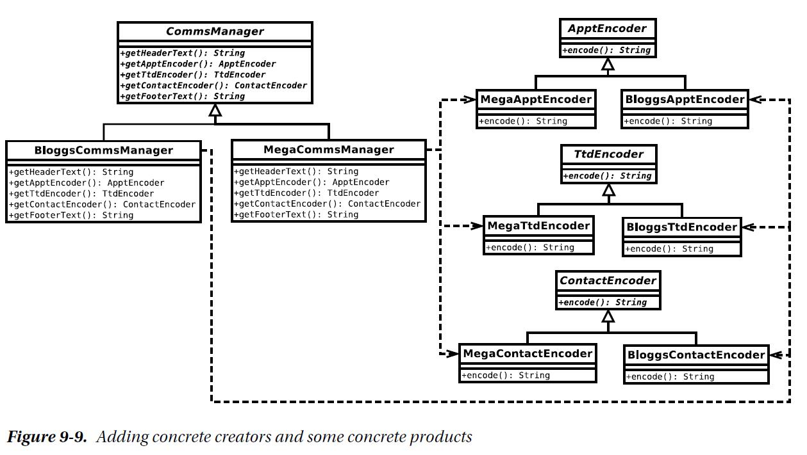

# The Problem

# Implementation

# consequences

First, I decouple my system from the details of implementation. I can add or remove
any number of encoding formats in my example without causing a knock-on effect.

I enforce the grouping of functionally related elements of my system. So, by using
BloggsCommsManager, I am guaranteed that I will work only with BloggsCal-related
classes.

Adding new products can be a pain. Not only do I have to create concrete
implementations of the new product, but I also have to amend the abstract creator
and every one of its concrete implementers in order to support it.

