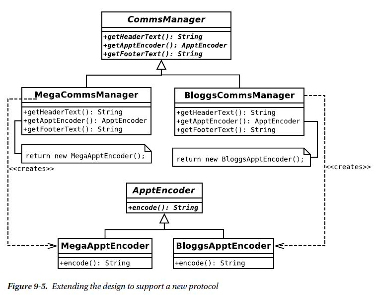

#The problems

1. I do not know until runtime the kind of object I need to produce
(BloggsApptEncoder or MegaApptEncoder)
2. I need to be able to add new product types with relative ease (SyncML support is just
a new business deal away!)
3. Each product type is associated with a context that requires other customized
operations (e.g., getHeaderText(), getFooterText())

#Implementation

#Consequences

Notice that the creator classes mirror the product hierarchy. This is a common consequence of the Factory
Method pattern and disliked by some as a special kind of code duplication. Another issue is the possibility
that the pattern could encourage unnecessary subclassing. If your only reason for subclassing a creator is
to deploy the Factory Method pattern, you may need to think again (that’s why I introduced the header and
footer constraints to the example here).

I have focused only on appointments in my example. If I extend it somewhat to include to-do items and
contacts, I face a new problem. I need a structure that will handle sets of related implementations at one
time. The Factory Method pattern is often used with the Abstract Factory pattern, as you will see in the next
section.
