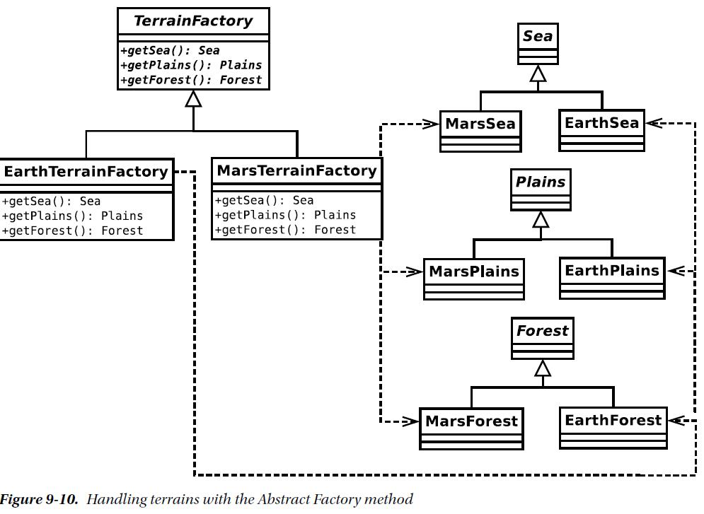

Every time you add a product
family, you are forced to create an associated concrete creator (the BloggsCal encoders are matched by
BloggsCommsManager, for example). In a system that grows fast enough to encompass many products,
maintaining this kind of relationship can quickly become tiresome.

One way of avoiding this dependency is to use PHP’s clone keyword to duplicate existing concrete
products.

