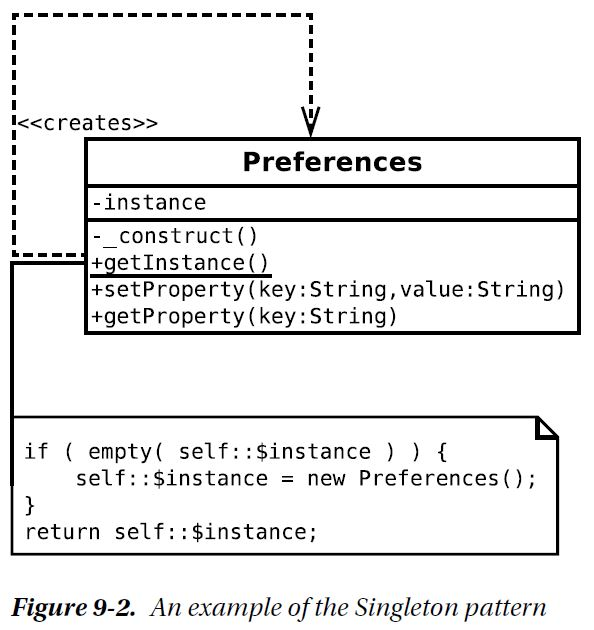

# THe Problem

1. A Preferences object should be available to any object in your system.

2. A Preferences object should not be stored in a global variable, which can be
overwritten.

3. There should be no more than one Preferences object in play in the system. This
means that object Y can set a property in the Preferences object, and object Z can
retrieve the same property, without either one talking to the other directly (assuming
both have access to the Preferences object).

# Implementation

Singleton_pattern\preferences.php

# Consequence

So, how does the Singleton approach compare to using a global variable? First, the bad news. Both
Singletons and global variables are prone to misuse. Because Singletons can be accessed from anywhere
in a system, they can serve to create dependencies that can be hard to debug. Change a Singleton, and
classes that use it may be affected. Dependencies are not a problem in themselves. After all, we create a
dependency every time we declare that a method requires an argument of a particular type. The problem
is that the global nature of the Singleton lets a programmer bypass the lines of communication defined by
class interfaces. When a Singleton is used, the dependency is hidden away inside a method and not declared
in its signature. This can make it harder to trace the relationships within a system. Singleton classes should
therefore be deployed sparingly and with care.

Nevertheless, I think that moderate use of the Singleton pattern can improve the design of a system,
saving you from horrible contortions as you pass objects unnecessarily around your system.
Singletons represent an improvement over global variables in an object-oriented context. You cannot
overwrite a Singleton with the wrong kind of data.
